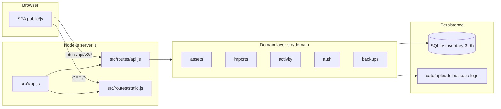
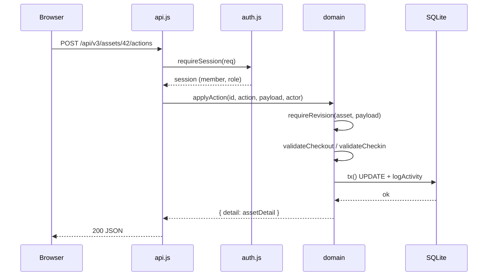
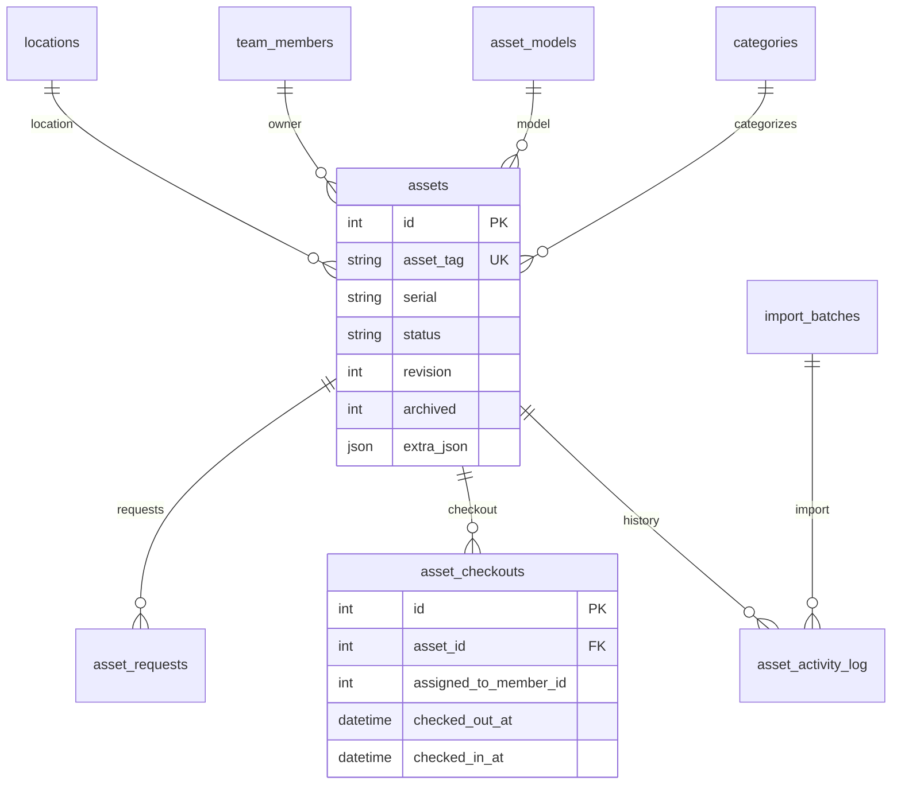
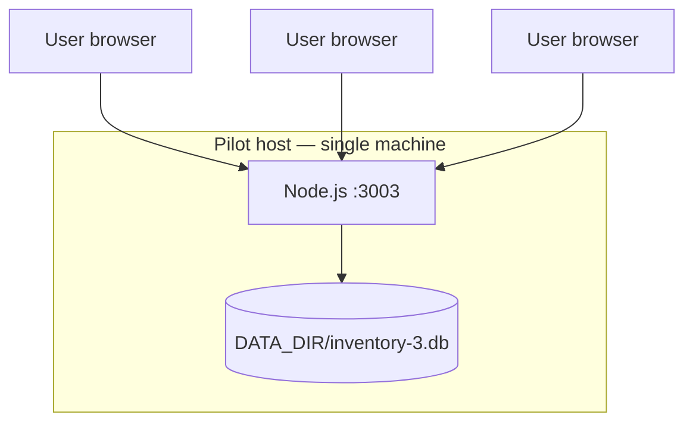

# Architecture

Inventory 3.0 is a **single-process Node.js application** that serves a vanilla JavaScript SPA and a JSON REST API from one HTTP server. All persistent state lives in **SQLite** on disk.

---

## High-level view



---

## Layer responsibilities

| Layer | Location | Role |
|-------|----------|------|
| **Entry** | `server.js` | Starts HTTP listener, loads DB migrations |
| **HTTP router** | `src/app.js` | Routes `/api/v3/*` vs static files; global error JSON |
| **API routes** | `src/routes/api.js` | Auth gate, method/path dispatch, role checks |
| **Domain** | `src/domain/*.js` | Business rules, validation, transactions |
| **DB access** | `src/db/index.js` | Schema init, migrations, `tx()`, activity log |
| **Frontend** | `public/js/` | SPA state, pages, forms, events — no framework |
| **Config** | `src/config/constants.js` | Categories, statuses, import profiles, seed roster |

Every database mutation goes through **`tx()`** in `src/db/index.js` so writes are atomic and activity logging stays consistent.

---

## Request lifecycle



### Public endpoints (no session)

- `GET /api/v3/health`
- `GET /api/v3/ready`
- `GET /api/v3/bootstrap` — member list for login screen
- `POST /api/v3/login`

All other `/api/v3/*` routes require a valid session cookie (`inventory3_session`) or `Authorization: Bearer` token.

---

## Data model (core entities)



### Key design choices

| Concept | Implementation |
|---------|----------------|
| **Optimistic locking** | Each asset has `revision`; PATCH and actions require matching revision (409 on conflict) |
| **Status governance** | `status_labels` table + deployable/available flags drive checkout rules |
| **Soft retirement** | `archived=1` when status is Archived or E-Wasted — not deleted |
| **Extra fields** | Category-specific columns stored in `extra_json` |
| **Audit trail** | `asset_activity_log` stores before/after snapshots for writes |

Migrations live in `migrations/*.sql` and are applied at startup.

---

## Frontend architecture

The UI is a **multi-page SPA** without React/Vue:

| Module | Purpose |
|--------|---------|
| `state.js` | Global app state (user, search, selection, modals) |
| `router.js` | Hash/URL sync, revision stale detection |
| `render.js` | Shell layout |
| `pages/*.js` | Search, reports, import, admin, activity, requests |
| `components/workspace.js` | Asset detail sheet, modals, bulk dialog |
| `events.js` | Click/submit handlers → API calls |
| `api.js` | `fetch` wrapper with cookie session |
| `forms.js` | Form serialization, add-asset helpers |

CSS is split: `base.css`, `layout.css`, `components.css`, `pages.css`, `print.css`.

---

## Authentication & roles

| Role | Capabilities |
|------|--------------|
| **Regular User** | Search, view, checkout/check-in, status change, requests, print, bulk (non-admin) |
| **Admin User** | Everything above + add/edit assets, import, backups, master data, model images |

Sessions are **in-memory** (Map) with 12-hour TTL. Restarting the server invalidates all sessions.

Pilot login: pick roster member (or Guest) + role. See [FAQ — Why no password?](faq.md#why-is-there-no-password-during-the-pilot).

The server **never trusts** client-supplied `actorName` for audit — actor comes from the session.

---

## Concurrency & SQLite

```text
PRAGMA journal_mode = WAL;
PRAGMA busy_timeout = 5000;
PRAGMA foreign_keys = ON;
```

- **WAL mode** allows concurrent readers while one writer holds the lock
- Designed for **3–4 users** on a dedicated pilot host
- Heavy parallel writes may see `SQLITE_BUSY` — retry or serialize bulk commits

Logs: `{DATA_DIR}/logs/app.log`

---

## File storage layout

Default `DATA_DIR=./data` (override with env var):

```text
data/
  inventory-3.db          # SQLite database
  uploads/                  # Model images
  backups/                  # Admin-triggered .db snapshots
  logs/app.log              # Structured errors and ops events
```

Set `DATA_DIR` outside the git repo for production.

---

## Deployment topology



| Variable | Default | Notes |
|----------|---------|-------|
| `HOST` | `127.0.0.1` | Bind address |
| `PORT` | `3003` | HTTP port |
| `DATA_DIR` | `./data` | All persistent files |
| `DB_PATH` | `{DATA_DIR}/inventory-3.db` | Override DB location |
| `NODE_ENV` | unset | Set `production` to disable dev seed |
| `SEED_MODE` | auto | Set `0` to skip synthetic seed data |

---

## Security controls (pilot)

| Control | Where |
|---------|-------|
| Session required on writes | `src/routes/api.js` |
| Admin gate | `requireAdmin()` |
| Revision conflict detection | `requireRevision()` in assets |
| XSS escaping in UI | `esc()` in render paths |
| CSV formula injection | `csvEscape()` on export |
| Import validation before commit | `validateImport()` |
| Restore confirmation phrase | `RESTORE <backupId>` |

See [HARDENING-RULES.md](HARDENING-RULES.md) for developer change constraints.

---

## Testing architecture

| Suite | File | Coverage |
|-------|------|----------|
| Hardening | `test/hardening.test.js` | Health, auth, CSV safety, create asset |
| Stress | `test/stress.test.js` | 10× iterations: CRUD, checkout, bulk, import, backup, reports |

Tests spawn a real server on port 3101 with isolated temp `DATA_DIR`.

---

## Related reading

- [Getting started](getting-started.md)
- [API overview](api-overview.md)
- [Troubleshooting](troubleshooting.md)
