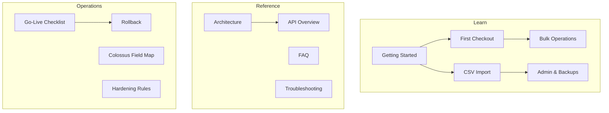

# Inventory 3.0 Documentation

Inventory 3.0 is a local-first lab inventory pilot for **#imargulis-staff**. It tracks GPUs, DPUs, servers, and related lab assets with search, checkout, bulk actions, CSV import, reports, and audit history — inspired by Colossus field layouts but built as a lightweight Node.js + SQLite application.

---

## Who this is for

| Audience | Start here |
|----------|------------|
| New lab user | [Getting started](getting-started.md) → [First checkout tutorial](tutorials/first-checkout.md) |
| Admin / data owner | [CSV import tutorial](tutorials/csv-import.md) → [Admin & backups](tutorials/admin-backups.md) |
| Operator / on-call | [Troubleshooting](troubleshooting.md) → [Rollback](ROLLBACK.md) |
| Developer | [Architecture](architecture.md) → [API overview](api-overview.md) |

---

## What you can do

- **Search** assets by serial, asset tag, model, category, status, location, and custom fields
- **Check out / check in** assets with owner, location, reason, and NVBUG linkage
- **Bulk actions** — checkout, check-in, status change, and label printing for multiple rows
- **Import** CSV batches with preview, validation, and idempotent commit
- **Reports & export** — filtered asset lists and Excel-safe CSV export
- **Activity log** — every write is attributed to the signed-in actor
- **Backups & restore** — admin-only SQLite snapshots with confirmation gate

There is **no hard delete**. Retire assets by setting status to **Archived** or **E-Wasted**.

---

## Quick start

```powershell
cd inventory-3.0
node server.js
```

Open [http://127.0.0.1:3003](http://127.0.0.1:3003), pick your name and role, and sign in.

Or double-click `start-local.cmd` (uses `node` from PATH with a Codex runtime fallback).

---

## Documentation map



| Section | Description |
|---------|-------------|
| [Architecture](architecture.md) | System design, data model, request flow, deployment |
| [Getting started](getting-started.md) | Install, configure, first login, navigation |
| [Tutorials](tutorials/first-checkout.md) | Step-by-step workflows |
| [FAQ](faq.md) | Common questions |
| [Troubleshooting](troubleshooting.md) | Errors, logs, recovery |
| [API overview](api-overview.md) | REST endpoints and auth |
| [Go-live checklist](GO-LIVE-CHECKLIST.md) | Pre-pilot smoke steps |
| [Rollback](ROLLBACK.md) | Backup and restore procedure |
| [Colossus field map](COLOSSUS-FIELD-MAP.md) | Import column mapping |
| [Hardening rules](HARDENING-RULES.md) | Change constraints for developers |

---

## Health checks

| Endpoint | Purpose |
|----------|---------|
| `GET /api/v3/health` | Process alive; returns data revision |
| `GET /api/v3/ready` | Database migrated and schema version present |

```powershell
curl http://127.0.0.1:3003/api/v3/health
curl http://127.0.0.1:3003/api/v3/ready
```

---

## Run tests

Automated smoke and stress tests (10× per major operation):

```powershell
node --test test/hardening.test.js test/stress.test.js
```

---

## Pilot scope (intentional limits)

- SQLite single-writer — suitable for **3–4 concurrent users** on one host
- Honor-system login (member + role picker) — **not** production SSO/LDAP
- Local network deployment — bind to `127.0.0.1` unless you explicitly expose the host
- No mobile-native app — responsive web UI only

See [FAQ](faq.md) for when to escalate beyond this pilot design.
